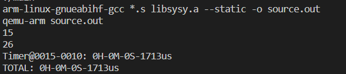
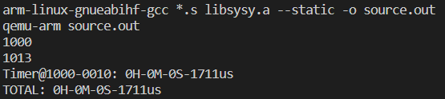
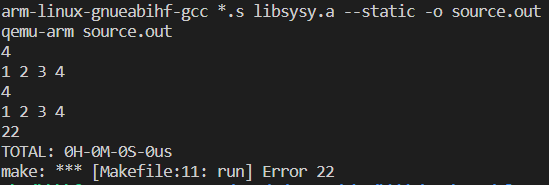
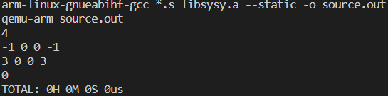
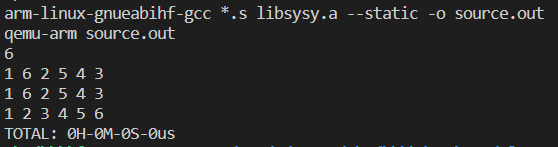
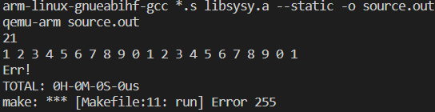

请在 `main.c` 文件中指定输入的 `fmj` 代码（部分测试代码位于 `test/` 目录下）。

输入 `make run` 即可编译+运行该编译器，`fmj` 代码的每个 method 均将在该目录下生成一个 `.s` 汇编代码，这些代码将在 `qemu` 模拟器上运行。

部分运行结果如下：

对 `final_simple.fmj` ：

对 `final_matrixmul_cld.fmj` ：

> 此处报 Error 是因为 `final_matrixmul_cld.fmj` 中 main 函数返回的是答案而不是 0

对 `final_bubblesort.fmj`：

> 因为程序会判断长度超过 20 的数组不合法